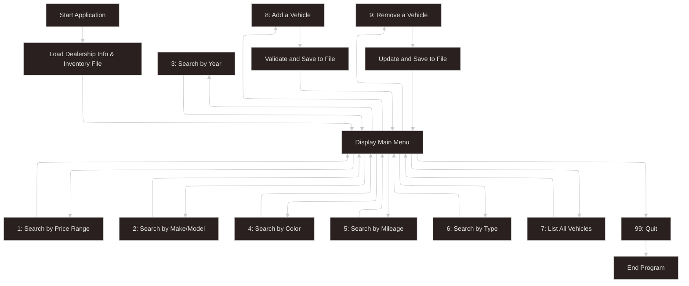

# 🚗 Dealership CLI App

A simple, console-based Java application that allows car dealership staff to manage vehicle inventory.  
Users can search, add, and remove vehicles, all while persisting data in a pipe-delimited file format.

## ✨ Features

- 🔍 Search vehicles by price range, make/model, year, color, mileage, or type
- 📋 List all available vehicles
- ➕ Add a vehicle to the inventory
- ❌ Remove a vehicle from the inventory
- 💾 Inventory data is stored and updated in a pipe-delimited `.txt` file

## ⚙️ How It Works

1. On launch, the app loads dealership info and inventory from a text file.
2. A user-friendly menu provides search and update options.
3. All changes (add/remove) are saved back to the file immediately.

```text
> Example inventory format:
VIN|Year|Make|Model|Type|Color|Odometer|Price
```
## 📋 Menu Options

```text
==== Dealership Menu ====
[1] Find vehicles within a price range
[2] Find vehicles by make / model
[3] Find vehicles by year range
[4] Find vehicles by color
[5] Find vehicles by mileage range
[6] Find vehicles by type (car, truck, SUV, van)
[7] List ALL vehicles
[8] Add a vehicle
[9] Remove a vehicle
[99] Quit
```

---

### ✅ Part 5: Tech Stack

## 🛠️ Tech Stack

```markdown
Java 17+
Object-Oriented Programming (OOP)
File I/O (`BufferedReader`, `PrintWriter`)
FBigDecimal for price accuracy
```

## 📁 Project Structure

```src/
├── app/
│ └── App.java
├── model/
│ ├── Dealership.java
│ └── Vehicle.java
├── service/
│ ├── DealershipFileManager.java
│ └── UserInterface.java
```

## 🧪 Sample Data Format

``` markdown
My Dealership|123 Main St|123-456-7890
1HGCM82633A004352|2018|Toyota|Camry|Sedan|White|45231.5|18995.00
2C3CDXBG3KH123456|2021|Toyota|RAV4|SUV|Blue|28910.3|23999.99
```

## 🗂️ Application Workflow



## 🚀 Project Goals

This project focuses on reinforcing core Java skills such as file I/O, object-oriented programming, loops, conditionals, and user input handling.  
It also emphasizes good development practices like version control, modular design, and readable code organization.

## 🎯 What's Next

Future plans include improving data validation, enhancing the user interface with better prompts and formatting, and potentially introducing a graphical UI using JavaFX or Swing.  
Longer-term goals could include migrating to a database-backed system or exposing the inventory via a REST API.

## 🙌 Final Notes

This console-based dealership app is a solid stepping stone in my Java learning journey.  
It demonstrates the fundamentals of building maintainable software and serves as a great portfolio piece for showcasing problem-solving and clean design.
