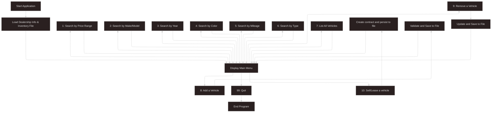

# 🚗 Dealership CLI App

A simple, console-based Java application that allows car dealership staff to manage vehicle inventory.  
Users can search, add, and remove vehicles, all while persisting data in a pipe-delimited file format.

Now refactored with a cleaner architecture:  
Add and remove operations are handled via a dedicated service layer for better separation of concerns.

## ✨ Features

- 🔍 Search vehicles by price range, make/model, year, color, mileage, or type
- 📋 List all available vehicles
- ➕ Add a vehicle to the inventory via `addVehicle(Vehicle)` method in the service
- ❌ Remove a vehicle using VIN via `removeVehicle(String)` method in the service
- 💾 Inventory data is stored and updated in a pipe-delimited `.txt` file
- 🧩 Clean architecture: logic extracted to service layer for maintainability and scalability
- 💼 Process sales or lease contracts directly from the UI menu

## ⚙️ How It Works

1. On launch, the app loads dealership info and inventory from a text file.
2. A user-friendly menu provides search and update options.
3. Business logic for adding/removing vehicles is handled in the service layer.
4. All changes are immediately persisted to the file.

```text
> Example inventory format:
VIN|Year|Make|Model|Type|Color|Odometer|Price
```

## 📋 Menu Options

```text
==== Dealership Menu ====
[1] Find vehicles within a price range
[2] Find vehicles by make / model
[3] Find vehicles by year range
[4] Find vehicles by color
[5] Find vehicles by mileage range
[6] Find vehicles by type (car, truck, SUV, van)
[7] List ALL vehicles
[8] Add a vehicle
[9] Remove a vehicle
[10] Sell/Lease vehicle
[99] Quit
```

---

## 🛠️ Tech Stack

```markdown
Java 17+
Object-Oriented Programming (OOP)
File I/O (`BufferedReader`, `PrintWriter`)
BigDecimal for price accuracy
Service Layer abstraction for cleaner architecture (e.g., DealershipService)
```

## 📁 Project Structure

```text
src/
├── main/
│   ├── java/
│   │   ├── contracts/
│   │   │   ├── Contract.java
│   │   │   ├── LeaseContract.java
│   │   │   └── SalesContract.java
│   │   ├── models/
│   │   │   ├── Dealership.java
│   │   │   └── Vehicle.java
│   │   ├── persistence/
│   │   │   ├── ContractFileManager.java
│   │   │   └── DealershipFileManager.java
│   │   ├── service/
│   │   │   └── DealershipService.java
│   │   ├── ui/
│   │   │   ├── InputManager.java
│   │   │   └── UserInterface.java
│   │   └── App.java
│   └── resources/
│       ├── contracts.txt
│       └── inventory.csv
├── test/
│   └── java/
│       └── app/
└── target/  (build output)
```


## 🧪 Sample Data Format

```markdown
My Dealership|123 Main St|123-456-7890
1HGCM82633A004352|2018|Toyota|Camry|Sedan|White|45231.5|18995.00
2C3CDXBG3KH123456|2021|Toyota|RAV4|SUV|Blue|28910.3|23999.99
```

## 🗂️ Application Workflow



## 🚀 Project Goals

This project focuses on reinforcing core Java skills such as file I/O, object-oriented programming, loops, conditionals, and user input handling.  
The recent service-layer abstraction improves separation of concerns and aligns with scalable software architecture principles.

## 🎯 What's Next

Planned improvements include:

- Better validation for user input (e.g., VIN uniqueness)
- Clearer error messages and console output
- Graphical user interface (GUI) using JavaFX or Swing
- Optionally migrate to a database (e.g., SQLite or PostgreSQL)
- Add unit testing with JUnit for the service layer
- Expand the service layer to support vehicle update/edit operations
- Add logging and exception handling for critical actions

## 🙌 Final Notes

This console-based dealership app is a solid stepping stone in my Java learning journey.  
The recent service-layer refactor showcases a cleaner, more scalable design pattern — preparing the codebase for testing and future GUI or web features.
